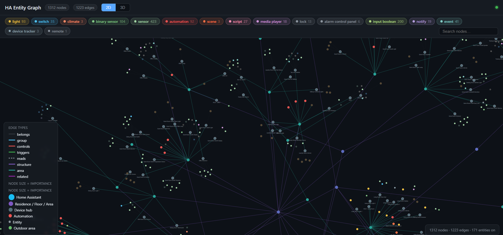
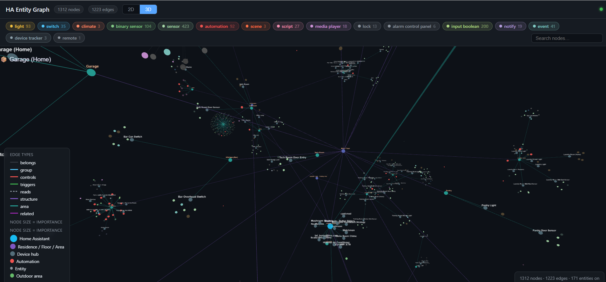

# homeassistant-force-graph

A live 2D/3D force-directed graph of your entire Home Assistant setup — floors, areas, devices, and entities — built automatically from your HA registries with no hardcoded data.




## Features

- **Whole-home auto-discovery** — floors → areas → devices → entities pulled live from HA registries on page load; no configuration required beyond your URL and token
- **Live state updates** — WebSocket connection shows real-time state changes with node color updates and flash animations
- **2D and 3D views** — toggle between a D3 force graph (2D) and a Three.js 3D force graph
- **Device controls** — click any node to open a side panel with controls: lights (on/off, brightness, color temp), switches, fans, climate (HVAC modes + presets), scenes, scripts, automations, media players
- **Domain filter chips** — dynamically built from your actual entities with counts; click to hide/show domains
- **Search** — filter nodes by name or entity ID
- **Automation/scene/script edges** — entity relationships extracted from automation triggers/actions and scene configs and drawn as "related" edges (purple)
- **Color-coded states** — on = full domain color, off = dimmed, unavailable = gray

## Setup

### 1. Get a Long-Lived Access Token

In Home Assistant:
1. Click your profile icon (bottom-left)
2. Scroll to **Security → Long-Lived Access Tokens**
3. Click **Create Token**, give it a name (e.g. `ha-graph`), copy the token

### 2. Edit index.html

Open `index.html` in a text editor and update the two lines at the top of the `<script>` block:

```js
const HA_URL   = "http://YOUR_HA_IP:8123";
const HA_TOKEN = "YOUR_LONG_LIVED_ACCESS_TOKEN";
```

Use `http://` unless you have a valid SSL certificate on your HA instance. Examples:
- `http://homeassistant.local:8123`
- `http://192.168.1.100:8123`

### 3. Open the page

Open `index.html` directly in a browser, or serve it from a web server on your local network. The page connects to HA via WebSocket on load and builds the graph automatically.

> **Note:** If opening as a local file (`file:///...`), some browsers block WebSocket connections to `http://` addresses due to mixed-content rules. Serving from a simple local web server avoids this — e.g. `python -m http.server 8080` in the project folder, then open `http://localhost:8080`.

## Dependencies

Dependencies are loaded from CDN by default — no installation needed.

| Library | Version | CDN |
|---|---|---|
| [D3.js](https://d3js.org/) | v7 | jsdelivr |
| [Three.js](https://threejs.org/) | 0.152.2 | jsdelivr |
| [3d-force-graph](https://github.com/vasturiano/3d-force-graph) | v1 | jsdelivr |

### Offline / local network use

To run without internet access, download the three library files and place them in the same folder as `index.html`:

```
https://cdn.jsdelivr.net/npm/d3@7/dist/d3.min.js
https://cdn.jsdelivr.net/npm/three@0.152.2/build/three.min.js
https://cdn.jsdelivr.net/npm/3d-force-graph@1/dist/3d-force-graph.min.js
```

Then replace the three `<script src="https://...">` lines in `index.html` with:

```html
<script src="d3.min.js"></script>
<script src="three.min.js"></script>
<script src="3d-force-graph.min.js"></script>
```

## Customization

### Showing / hiding domains

`SHOW_DOMAINS` and `HIDE_DOMAINS` near the top of the script control which entity domains appear as nodes. Edit these sets to match your preference.

### Node colors and icons

The `DOMAIN_META` object maps each domain to a color, icon, and category. Edit to taste.

### Force layout tuning

- **2D:** Adjust `d3.forceManyBody().strength()`, link distances, and collision radius in `update2D()`
- **3D:** Adjust `graph3d.d3Force('charge').strength()` and link distances in `init3D()`

## Notes

- The page uses the HA WebSocket API exclusively — no REST calls. This avoids CORS issues entirely.
- All 8 registry requests (states, floors, areas, devices, entities, automations, scenes, scripts) are sent in parallel on connect and the graph renders when all respond.
- The WebSocket auto-reconnects every 5 seconds if the connection drops.
- For `https://` HA instances, the WebSocket URL automatically becomes `wss://`.

## License

MIT
